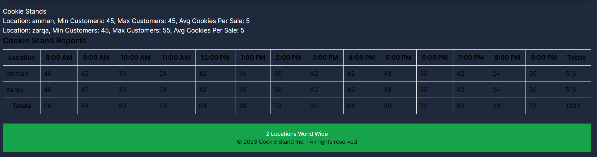

# Cookie Stand Admin

## Summary
The Cookie Stand Admin is a web application built using React, Next.js, and Tailwind CSS. It allows users to create and manage information about cookie stands, including their location, minimum and maximum customers, and average cookies sold per sale.

## Description
This web application provides a user-friendly interface for adding new cookie stands and viewing their details. It uses modern web technologies to ensure a smooth and responsive user experience.

## Installation and Running Locally

To run the Cookie Stand Admin application on your local machine, follow these steps:

1. Clone this repository to your local machine using Git:
   ```bash
   git clone <repository-url>

2.Navigate to the project directory:


cd cookie-stand-admin
3.Install the project dependencies using npm or yarn:


            npm install
            
# or

          yarn install
4.Start the development server:


3.Open your web browser and access the application at http://localhost:3000.

this our app :


## Setup and Environment
#### The Cookie Stand Admin application is built using the following technologies:

- React: A JavaScript library for building user interfaces.
- Next.js: A React framework for server-rendered applications.
- Tailwind CSS: A utility-first CSS framework.
- Node.js: A JavaScript runtime environment for running JavaScript on the server.
- 
#### You will need the following software installed on your machine:

- Node.js: Download Node.js
No additional environment settings or configurations are required to run the application locally.

### Usage
To add a new cookie stand, fill in the location, minimum customers, maximum customers, and average cookies per sale in the form and click the "Create Cookie Stand" button.
The application will display the details of the newly created cookie stand, including the JSON data, below the form.
### Contributing
Contributions to this project are welcome! If you find any issues or have suggestions for improvements, please open an issue or create a pull request.


# Lab 38: Cookie Stand Admin App Development
## Tasks Completed Today:
- Set up a Next.js project for the Cookie Stand Admin app.

- Created a custom <Header> component for the app's header.

- Developed the <CreateForm> component, which allows users to add new cookie stands with location and hourly sales data.

- Implemented a function to handle the creation of new cookie stands and store them in a state array.

- Designed a <Footer> component that displays the number of cookie stand locations worldwide based on the stored data.

- Worked on styling the app using Tailwind CSS utility classes.

- Created an <Overview> page to display an overview of the app.

- Added navigation links between the main page and the overview page.

- Set up an array to store data for cookie stands and used it to generate reports.

- Developed the <ReportTable> component to display reports and calculate totals per hourly slot.

## Challenges Faced:
- Initially had issues with routing and linking between pages, but resolved them by adjusting the folder structure and using correct Link components.

- Styling the components to match the provided spec required some time and experimentation with Tailwind CSS.

## Visual

## Additional Notes:


Used version control (e.g., Git) to track changes and collaborate on the project.

